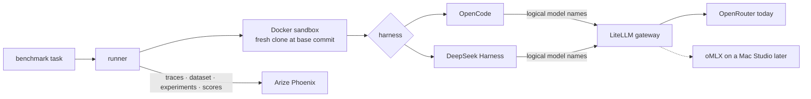
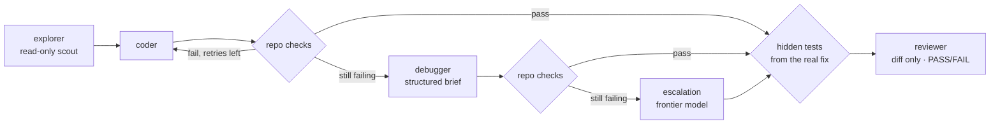

# coding-harness

**Measure whether cheap (eventually local) models can do real software work, and which setup gets them there.**

coding-harness runs coding agents against real historical changes from real repositories, checks the
result with the repository's own build and tests plus the tests from the real fix, and records what
every model call cost. It compares models, role assignments and agent harnesses on the same tasks.

> Can a hierarchy of inexpensive models, driven by a strong coding harness, complete most real
> development tasks while escalating only the hard ones to a frontier model?

[How it works](#how-it-works) ·
[Quick start](#quick-start) ·
[Experiments](#experiments) ·
[Benchmark tasks](#benchmark-tasks) ·
[Results](#results) ·
[Configuration](#configuration) ·
[Limitations](#known-limitations)

---

## How it works



Each run walks a fixed pipeline. Every role is its own headless harness session with a fresh context:



- **Success is objective.** A task passes only if the repository's checks *and* the hidden tests from
  the historical fix pass. What the model says about its own work never counts.
- **Failures are classified.** *Infra* (429, 5xx, timeouts) is retried on the same model and never
  escalates. *Model* (crash, empty run, no tool call) and *verification* (checks fail) move the
  pipeline forward. Every escalation is recorded with its reason.
- **The reviewer is scored, not trusted.** Its verdict is compared with the real outcome
  (`review_agrees`), so reviewer quality is measured too.
- **Models are swappable by config.** The harness only knows gateway model names. Moving a model from
  OpenRouter to local hardware changes the gateway, not this repository ([docs/omlx.md](docs/omlx.md)).

## Quick start

Requirements: Docker, [uv](https://docs.astral.sh/uv/), [just](https://just.systems), an
OpenAI-compatible [LiteLLM](https://docs.litellm.ai) gateway that serves the model names used in
`experiments/`, and optionally [Arize Phoenix](https://phoenix.arize.com).

```bash
cp .env.example .env        # gateway URL + key, Phoenix URL
uv sync
just build                  # sandbox images coding-harness:{python,go,node}
just validate               # every task: hidden tests fail on base, pass on the real fix
just run tuppr-single-node-drain B-qwen-coder
```

The run prints a summary and leaves everything under `runs/<run-id>/`.

| Command | What it does |
|---|---|
| `just build [toolchain]` | Build sandbox images (toolchain + pinned OpenCode and DeepSeek Harness) |
| `just validate [task…]` | Check that tasks can tell a correct fix from no change |
| `just import-swebench [--repos … --per-repo N]` | Import SWE-bench Verified instances as tasks |
| `just run <task> <experiment>` | Run one task under one experiment locally |
| `just show <run-id>` | Print a run's summary |
| `just dataset` | Upload `benchmark/` to Phoenix as a dataset |
| `just experiment <experiment>` | Run an experiment over the whole Phoenix dataset |
| `just reset` | Delete `runs/` and leftover sandbox containers |

## Development

```bash
lefthook install   # pre-commit: gitleaks, ruff, config check; pre-push: pytest
uv run pytest -q
uv run harness check-config
```

CI (GitHub-hosted runners) runs lint, format check, config check, tests, gitleaks and a sandbox image build
on every push and PR. Renovate keeps dependencies current; OpenCode and DeepSeek Harness bumps are never
automerged (label `harness-version`) because they change benchmark results.

## Experiments

An experiment maps roles to gateway models. `experiments/_defaults.yaml` holds the shared context
budgets, step limits and retry policy; an experiment overrides only what differs. Omit a role to skip it.

```yaml
# experiments/F-hierarchy-frontier.yaml
name: F-hierarchy-frontier
description: Full local hierarchy with one frontier escalation after local debugging fails.
models:
  explorer: basic/glm-5.3-flash
  coder: basic/qwen3-coder-next
  debugger: basic/deepseek-v4.1-flash
  reviewer: basic/deepseek-v4.1-flash
  escalation: frontier-code
policy:
  escalation_attempts: 1
```

| Experiment | Question |
|---|---|
| `A-glm-coder` | How far does GLM 5.3 Flash get as the implementer? |
| `B-qwen-coder` | How far does Qwen3 Coder Next get as the implementer? |
| `C-glm-explore-qwen-code` | Does a cheap scout make the coder better? |
| `D-qwen-deepseek-debug` | Does a separate debugger rescue failed attempts? |
| `E-qwen-only` | Does specialization beat one model for every role? |
| `F-hierarchy-frontier` | How much frontier work does the full local hierarchy still need? |
| `G-qwen38-flash-coder`, `H-qwen38-27b-coder` | Newer / smaller implementers |
| `B-qwen-coder-dsh` | Experiment B on DeepSeek Harness instead of OpenCode |
| `default` | Gateway role aliases (`local-fast`, `local-code`, `local-reason`, `frontier-code`) |

Experiments pin concrete gateway models, so remapping a gateway alias never silently changes an
earlier experiment. To try a new model, add it to the gateway and reference it in an experiment file.

**Prompt sets.** In OpenCode an agent's own prompt *replaces* the harness system prompt
(`packages/opencode/src/session/llm/request.ts`). `prompts: custom` (default) uses only our role
prompts; `prompts: vendor` keeps OpenCode's own prompt (`harnesses/opencode/vendor/default.txt`) and
appends the role. `B-qwen-coder-vendor` compares the two.

## Benchmark tasks

A task is a real historical change. The agent starts at the commit before the fix with an issue-style
prompt; the tests the real fix added stay hidden until final verification.

```yaml
# benchmark/tuppr-single-node-drain.yaml
id: tuppr-single-node-drain
category: non-trivial-bugfix
toolchain: go                     # selects the sandbox image
repo: https://github.com/lkshrk/tuppr
base: 23d5fd80c528…               # parent of the fix
reference: a82650e352             # the real fix (never shown to agents)
hidden_tests:
  - internal/controller/talosupgrade/controller_test.go
prompt: |
  On a single-node cluster the Talos upgrade Job runs on the node it upgrades. …
verify:
  - name: build
    run: go build ./...
  - name: test
    run: go test ./internal/controller/talosupgrade/...
```

**SWE-bench Verified.** `just import-swebench` turns SWE-bench Verified instances into tasks: the
problem statement becomes the prompt, `test_patch` the hidden tests, `patch` the reference fix, and the
SWE-bench environment spec a per-task setup (a venv with the historical Python version in the sandbox
HOME). Checks run the same test selection as the SWE-bench harness (`PASS_TO_PASS` while the agents
work, `FAIL_TO_PASS` + `PASS_TO_PASS` at the end). Only repos with plain pip environments are
supported so far (requests, flask, pytest, pylint, sympy, seaborn, xarray). The reconstructed
environments differ from SWE-bench's official images, so some instances fail `just validate` (their
listed tests fail even on the reference fix); drop those. First import: 9 of 17 instances valid.

Task fields beyond the example: `setup` (commands before the agents start), `env` (sandbox
environment), `hidden_verify` (checks after the hidden tests are restored, default `verify`),
`reference_patch` / `hidden_test_patch` (inline diffs instead of a reference commit).

**Adding a task**
1. Pick a merged fix or feature commit that added or changed tests.
2. Set `base` to its parent and `reference` to the commit.
3. Write the prompt as the issue it solved, not the solution. Name any API the hidden tests rely on.
4. List the repository's own check commands and the test files the change touched.
5. Run `just validate <id>`. A task whose hidden tests already pass on `base` is rejected, because
   its tests cannot tell a fix from no change.

## Results

Every run leaves a directory you can inspect or diff:

```
runs/<task>.<experiment>.<timestamp>/
├── result.json      outcome, checks, hidden tests, review verdict, escalations, tokens, cost, time
├── steps.jsonl      one line per agent call: role, model, duration, tool calls, tokens, failure class
├── raw/             each agent call's raw harness event stream
├── final.diff       the change the agents produced
├── repo/            the sandbox clone
└── home/            the sandbox HOME, including harness configs and session logs
```

```jsonc
// result.json (excerpt)
{
  "outcome": "failure",            // repo checks AND hidden tests
  "checks_passed": true,
  "hidden_tests_passed": false,
  "review_verdict": "FAIL",
  "review_agrees": true,           // reviewer matched the real outcome
  "attempts": 1,
  "escalations": [],
  "frontier_used": false,
  "tool_calls": 109,
  "tokens": {"input": 314884, "output": 13046, "cache_read": 2190144},
  "cost_usd": 0.2447,              // spend the gateway booked for this run
  "wall_s": 571.9
}
```

In **Phoenix**, every run is a trace in the `coding-harness` project, grouped by run id as session:

```
run:<task>              CHAIN   task prompt → outcome, cost, escalations
├── explorer            AGENT   model, tokens, tool calls, report
├── coder               AGENT   …
├── checks:coder#1      TOOL    failing check output or "all checks passed"
├── debugger            AGENT   …
├── checks:hidden-tests TOOL
└── reviewer            AGENT   verdict
```

The runner emits these spans itself (OpenTelemetry, OpenInference attributes), so tracing works the
same for both harnesses and needs nothing from the gateway. Inside `just experiment` each trace is
nested under Phoenix's experiment run, so opening a result in the experiment comparison shows it. `result.json` stores the root span's
`trace` ids; annotate that span in Phoenix to mark human intervention. `just experiment` additionally
records each task as an experiment run with evaluator scores (`success`, `checks_passed`,
`review_agrees`, `frontier_used`, `escalations`, `cost_usd`), so experiments compare side by side.

## Configuration

| Variable | Purpose |
|---|---|
| `LITELLM_BASE_URL` | OpenAI-compatible gateway, including `/v1` |
| `LITELLM_API_KEY` | Gateway key for the harness; scope it to the models it needs |
| `EXTRA_CA_CERT` | Optional PEM for a private CA in front of the gateway (sandbox and host clients) |
| `PHOENIX_BASE_URL` | Phoenix UI/API and trace endpoint (tracing is off when unset) |
| `PHOENIX_API_KEY` | Only if Phoenix authentication is enabled |

```
benchmark/            tasks (one YAML per task)
experiments/          role → model mappings, _defaults.yaml for budgets and policy
agent/                deployed agent config for Coder workspaces (rules, agents, commands, plugins, skills)
harnesses/opencode/   agent prompts (explorer, coder, debugger, reviewer)
harnesses/dsh/        DeepSeek Harness profile template
docker/Dockerfile     sandbox image: toolchain + OpenCode + DeepSeek Harness, pinned
src/coding_harness/   runner, sandbox, harness adapters, verification, Phoenix, task validation
docs/                 architecture and decisions, moving models to oMLX
```

**Sandbox safety.** Each run gets its own container. Only the run's clone and a fresh HOME are
mounted; no host credentials, dotfiles or git config reach the agent. Host git hooks are disabled for
the clone. The clone holds the base commit and its ancestors only: later commits would include the
reference fix, so the full clone used for hidden tests stays on the host in `runs/<id>/source`.
`just reset` removes everything.

**Interactive use.** OpenCode can use the same gateway: copy the `provider` block from a run's
`home/.config/opencode/opencode.json` into `~/.config/opencode/opencode.json` and pick
`litellm/local-code`, `litellm/frontier-code` etc. in the model picker.

## Known limitations

- OpenCode subagents on non-frontier models may receive no tools
  ([anomalyco/opencode#51268](https://github.com/anomalyco/opencode/issues/51268)), so roles run as
  separate headless sessions driven by the runner, not through OpenCode's task tool.
- DeepSeek Harness is prerelease; its profile layout and event names may change between versions.
  It has no per-role step limit. Its compaction needs explicit settings for small context windows
  (see `harnesses/dsh/profile.tmpl.yml`).
- Token counts come from each harness and are not directly comparable between harnesses; gateway
  spend (`cost_usd`) is the common measure.
- Context budgets are per model: a model shared by several roles gets the largest budget.
- `cost_usd` is the harness key's spend delta over a run, so runs sharing a key must not overlap.
- The benchmark is still small: two tuppr tasks plus imported SWE-bench tasks. SWE-bench repos are
  public and may be in the models' training data; your own tasks guard against that.

## Further reading

- [docs/architecture.md](docs/architecture.md): components, design decisions, data flow
- [docs/omlx.md](docs/omlx.md): moving a model to local hardware
